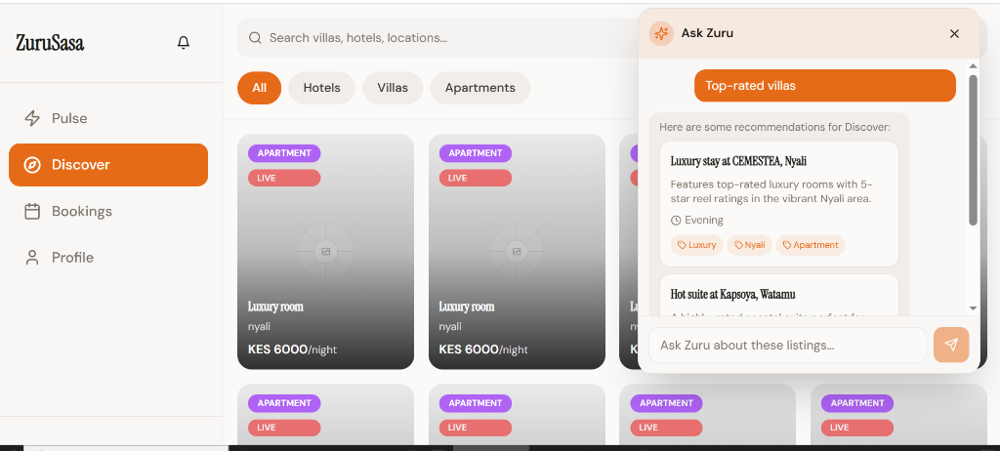

# ZuruReels 🌍
### The Pulse of Coastal Discovery

[**Live Demo**](https://zurureels.vercel.app) • [**Developer Documentation**](./docs/DOCUMENTATION.md)

ZuruReels is a state-of-the-art PWA designed to connect travelers and locals with the heartbeat of coastal cities. By combining authentic short-form video content with AI-powered discovery, we make finding your next coastal adventure as simple as a scroll.

---

## 📸 Platform Spotlight

<div align="center">
  
  <p><i>The Discover Page: Seamless AI-powered exploration and immersive property reels.</i></p>
</div>

---

## ✨ Core Experience

### 🌊 City Pulse (Reels)
Immerse yourself in high-quality, short-form reels of coastal experiences.
- **Instagram-Style Autoplay**: Smooth, muted video playback as you scroll through trending property highlights.
- **Hardware-Verified Status**: Every "Live" reel is recorded on-site with verified geographic location data for maximum authenticity.
- **Categories for Every Mood**: From luxury boat rentals to sunset food spots, discover exactly what you need.

### 🤖 Ask Zuru AI
Your personal coastal concierge, powered by advanced AI.
- **Contextual Discovery**: Ask Zuru about current listings, weather-appropriate activities, or the best nightlife in town.
- **Interactive Chat**: Get real-time recommendations and book experiences directly from the conversation.

### 📱 Native Mobile Optimized
Built for the modern mobile user.
- **Capacitor Integration**: Seamlessly runs as a native Android app with full hardware support.
- **Safe Area Design**: Crafted for notched devices (iPhone, Dynamic Island) and modern gesture-based navigation.
- **Touch-First UI**: Large touch targets, glassmorphism aesthetics, and responsive layout systems.

### 💳 1-Click Checkout
Bookings made simple.
- **Unified Booking**: Book boats, hotel rooms, or event entries in seconds.
- **Secure Payments**: Fully integrated with Paystack for safe local and international transactions.

---

## 📂 Project Structure

The project uses a high-performance modern stack:

- **`/frontend`**: React 18 (Vite, Tailwind v3, Shadcn UI)
  - Features: Capacitor.js, Framer Motion, Lucide Icons.
- **`/backend`**: Supabase Infrastructure
  - Features: Real-time database, Edge Functions, Row-Level Security (RLS).
- **`/android`**: Native Capacitor project for Android hardware integration.

---

## 🚀 Getting Started

### Prerequisites
- Node.js 18+
- Android Studio (for native mobile development)

### Frontend & Development
1. **Setup**:
   ```bash
   cd frontend && npm install
   ```
2. **Local Run**:
   ```bash
   npm run dev
   ```
3. **Mobile Build**:
   ```bash
   npm run build
   npx cap sync android
   ```

---

## 🔑 Authentication
Secure access is provided via **Supabase Auth**, supporting:
- Email/Password with Magic Links
- Google OAuth Integration
- Host/User Role Management

---

<div align="center">
  <p>Made with ❤️ for Coastal Explorers</p>
</div>
